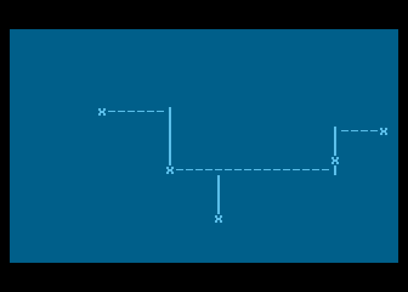
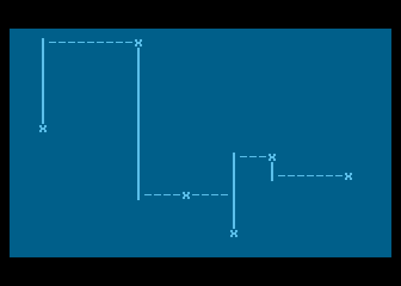
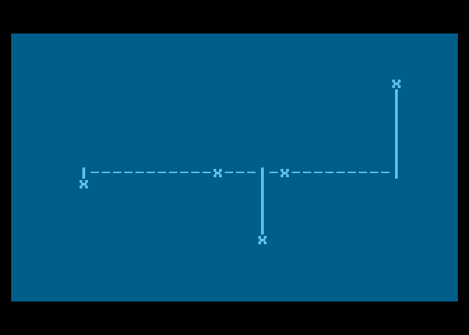
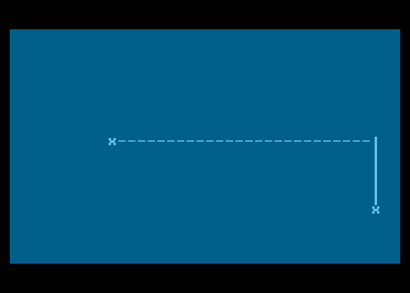

# Minimum Spanning Tree

This is a makeshift implementation of the Kruskal's algorithm for finding the Minimum Spanning Tree implemented in Pascal, tested on Atari 8-bit.

The idea is to connect Vertices in a graph (cities) with edges (roads) in an efficient way.

# Screenshots

